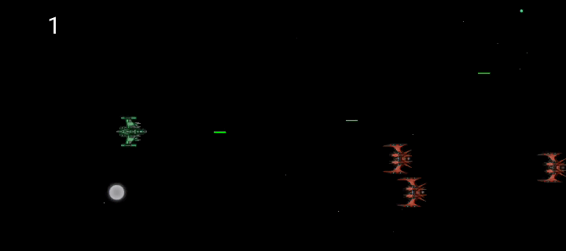

# Starships Android Game

Starships Android Game es un juego simple desarrollado en Android como proyecto para la asignatura M08 (Programación para dispositivos móviles) de DAM. ¡Pilota la nave, esquiva las naves enemigas y destrúyelas para obtener la puntuación más alta!

## Características Adicionales

- **Movimiento Suave:** La nave del jugador se mueve suavemente en respuesta a los toques de pantalla, proporcionando una experiencia de juego fluida.

- **Generación Dinámica de Naves Enemigas:** Las naves enemigas se generan dinámicamente, lo que significa que el juego se vuelve más desafiante con el tiempo al incrementar la frecuencia de aparición de naves enemigas.

- **Estrellas en el Fondo:** El fondo del juego presenta un efecto visual atractivo con estrellas generadas aleatoriamente, proporcionando un entorno espacial inmersivo.

- **Disparos y Colisiones:** El jugador puede disparar y destruir naves enemigas, mientras que las colisiones con las naves enemigas conducen a un final de juego.

- **Puntuación Dinámica:** La puntuación se incrementa cada vez que el jugador destruye con éxito una nave enemiga, lo que añade un elemento competitivo al juego.

- **Ajuste de Dificultad:** La dificultad del juego es configurable, permitiendo a los jugadores elegir entre niveles de dificultad como "Fácil", "Normal" o "Difícil".

- **Personalización del Jugador:** Al inicio del juego, se solicita al jugador que ingrese su nombre y seleccione la dificultad, proporcionando una experiencia personalizada.

- **Música y Efectos de Sonido:** El juego cuenta con música de fondo y efectos de sonido, mejorando la experiencia auditiva del jugador.

- **Reinicio del Juego:** Después de una colisión, el jugador puede elegir reiniciar el juego desde el principio.

- **Pausa Automática:** El juego se pausa automáticamente cuando se muestra el cuadro de diálogo para ingresar el nombre y seleccionar la dificultad.

- **Manejo de Recursos de Audio:** Los recursos de audio, como la música de fondo y los efectos de sonido, se gestionan adecuadamente para evitar problemas de memoria.

Recuerda actualizar esta sección según los cambios y características específicas que desees destacar en tu juego.

## Capturas de Pantalla

WIP

## Instalación del repositorio

1. Clona el repositorio: `git clone https://github.com/tu_usuario/starships-android-game.git`
2. Abre el proyecto en Android Studio.
3. Conecta tu dispositivo Android o utiliza un emulador.
4. Ejecuta la aplicación.

## Licencia

Este proyecto está bajo la Licencia MIT - ver el archivo [LICENSE](LICENSE) para más detalles.

## Fuentes de los Recursos Utilizados

- **Música**: [Space Dimensions (8bit/Retro Version)](https://opengameart.org/content/space-dimensions-8bitretro-version) (Licencia: Creative Commons)
- **Sonido de Laser**: [Laser Fire](https://opengameart.org/content/laser-fire) (Licencia: Creative Commons)
- **Sprites de Naves**: [Space Ship Construction Kit](https://opengameart.org/content/space-ship-construction-kit) (Licencia: GPL-3.0)
